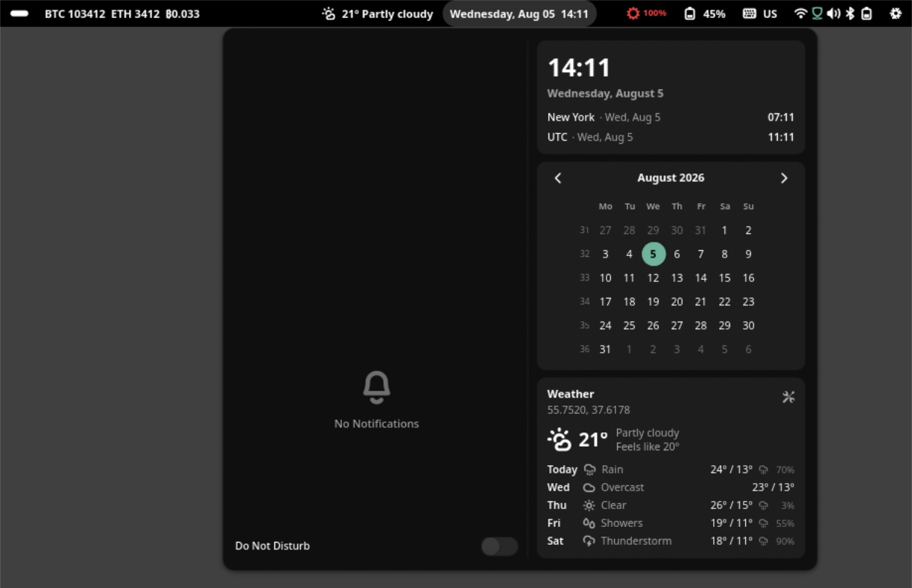

# topbar

A GNOME Shell-style top bar for [niri](https://github.com/YaLTeR/niri), built
with GTK4 and `gtk4-layer-shell`. GNOME Shell is the design inspiration only —
topbar is not affiliated with or endorsed by the GNOME Project.


One solid, full-width panel pinned to the top of every monitor: workspaces and
indicators on the left, clock and weather in the center, tray, alerts and the
quick-settings aggregate menu on the right. Clicking the clock opens a GNOME
date menu with notifications, calendar, world clocks, media controls and the
weather forecast.



## What is on the bar

- **workspaces** — GNOME Activities-style dots with an animated active pill,
  filtered to the monitor they are on. Urgent workspaces pulse.
- **clock** — any `strftime` format, aligned to the boundary, with the date
  menu behind it: notification history with grouping and Do Not Disturb, a
  calendar, world clocks, MPRIS media controls and a five-day forecast. A dot
  beside the time says the history holds something you have not opened yet.
- **weather** — Open-Meteo current conditions and forecast, with a location
  search dialog. One cache for the whole panel.
- **crypto** — bitcoin, ethereum and monero prices from CoinGecko, singly or as
  pair ratios, with a popover that edits the list without touching your config.
- **tray** — StatusNotifierItem host with dbusmenu support and an overflow
  chevron.
- **system_monitor** — invisible while the machine is healthy; fades in with
  warning-tinted icons once CPU, memory or disk crosses a threshold.
- **headset** — battery for a 2.4GHz wireless headset, via `headsetcontrol`.
- **keyboard_layout**, **os_logo**, and **custom-\*** widgets that run a script
  and speak Waybar's JSON contract.
- **quick_settings** — the GNOME 45 aggregate menu: Wi-Fi (with a secret agent
  for passwords), Bluetooth (with a pairing agent), VPN, volume and microphone,
  brightness, Power Mode, Caffeine, battery health with charge thresholds,
  pending updates, a resource overview, privacy dots, and a power section that
  asks you to hold the row down.

Plus the surfaces that are not widgets: the notification daemon and its
banners, the volume and brightness OSD capsule, and compositor blur behind
everything the panel draws.

**Configuration is applied live.** Save `config.toml` and the panel changes:
colours are a stylesheet swap, a widget's own section rebuilds that widget, and
only the bar's geometry rebuilds the bars. A file that does not parse changes
nothing and says so in one banner.

## Install

The flake exposes a package and an overlay for `x86_64-linux`.

```nix
# flake.nix
{
  inputs.topbar.url = "github:trevarj/topbar";

  outputs = { nixpkgs, topbar, ... }: {
    nixosConfigurations.yourhost = nixpkgs.lib.nixosSystem {
      modules = [
        { nixpkgs.overlays = [ topbar.overlays.default ]; }
        { environment.systemPackages = [ pkgs.topbar ]; }
      ];
    };
  };
}
```

Or run it without installing:

```sh
nix run github:trevarj/topbar
```

## Running under niri

Add to `~/.config/niri/config.kdl`:

```kdl
spawn-at-startup "topbar"

// Media keys route through the panel so they show an OSD.
binds {
    XF86AudioRaiseVolume  allow-when-locked=true { spawn "topbar" "volume" "inc" "5"; }
    XF86AudioLowerVolume  allow-when-locked=true { spawn "topbar" "volume" "dec" "5"; }
    XF86AudioMute         allow-when-locked=true { spawn "topbar" "volume" "toggle-mute"; }
    XF86MonBrightnessUp                          { spawn "topbar" "brightness" "inc" "5"; }
    XF86MonBrightnessDown                        { spawn "topbar" "brightness" "dec" "5"; }
}

// Blur behind the panel and its popovers, if you want it. `theme.blur = true`
// in topbar's own configuration asks for the region; this is what the
// compositor does with it.
layer-rule {
    match namespace="^topbar$"
    match namespace="^topbar-popover$"

    background-effect {
        xray false
    }
}
```

The panel reserves an exclusive zone, so niri lays windows out beneath it
automatically.

The volume and brightness commands act on PulseAudio and logind **directly**
and only then try to raise an OSD, so a media key still works when the panel is
not running and when the configuration is broken.

## Configuration

Configuration lives at `~/.config/topbar/config.toml`. Every key is optional;
anything you leave out falls back to the built-in default.

```sh
topbar --print-example-config > ~/.config/topbar/config.toml
topbar --check-config
```

The lookup order is `$XDG_CONFIG_HOME/topbar/config.toml`, then
`~/.config/topbar/config.toml`, then the same two under the project's former
`gnome-topbar` name, then `./config.toml`. Pass `--config PATH` to use a
specific file (it must exist), and `--strict` to turn configuration warnings
into errors.

The tables below list every module and every key. The longer story — search
order, v1 compatibility, what hot reload costs per key, what the panel never
writes — is [docs/configuration.md](docs/configuration.md). How the thing is
built: [docs/architecture.md](docs/architecture.md).

### `[bar]`

| Key | Default | Meaning |
|---|---|---|
| `position` | `"top"` | Screen edge. `"top"` is the only value; `"bottom"` is an error. |
| `size` | `36` | Bar height in pixels. Must be above zero. |
| `spacing` | `2` | Gap between widgets. |
| `screen_margin` | `0` | Gap between the screen edge and the bar window. |
| `inset` | `4` | Gap between the bar edge and the first/last section. |
| `padding` | `0` | Extra vertical padding inside the bar. |
| `border_radius` | `0` | Bar corner radius in pixels. |
| `popover_offset` | `1` | Gap between the bar and popovers anchored to it. |
| `background_color` | `"#000000"` | Bar background colour (hex). |
| `background_opacity` | `1.0` | Bar background opacity, `0.0`–`1.0`. |

### `[widgets]` — placement and shared styling

| Key | Default | Meaning |
|---|---|---|
| `left` | `["workspaces"]` | Left section, in order. |
| `center` | `["clock"]` | Center section, in order. |
| `right` | `["tray", "quick_settings"]` | Right section, in order. |
| `border_radius` | `50` | Widget corner radius as a percentage of bar height; `50`+ is a full pill. |
| `background_color` | unset | Widget surface colour. Unset uses the theme surface. |
| `background_opacity` | `0.0` | Widget background opacity; `0.0` = transparent until hovered. |
| `popover_background_opacity` | unset | Popover opacity. Unset follows the bar's. |

Available widgets: `workspaces`, `clock`, `weather`, `crypto`, `tray`,
`quick_settings`, `system_monitor`, `headset`, `keyboard_layout`, `os_logo`,
and any number of `custom-<name>` script widgets. Every `[widgets.<name>]`
section also accepts `on_click`, `on_click_right` and `on_click_middle` shell
commands; widgets whose click already does something (opening a popover, say)
accept the keys but act only on the buttons they have free.

### `[widgets.workspaces]`

| Key | Default | Meaning |
|---|---|---|
| `label_type` | `"none"` | `"none"` (dots), `"index"`, or `"name"`. |
| `animate` | unset | Animate dot/pill transitions. Unset follows `theme.animations`. |
| `filter_by_output` | `true` | Show only this monitor's workspaces. |
| `show_unoccupied` | `false` | Show workspaces that hold no windows. |

### `[widgets.clock]`

| Key | Default | Meaning |
|---|---|---|
| `format` | `"%a %b %-d  %H:%M"` | `strftime` format for the panel label. |
| `control_panel` | `false` | Open the notifications/calendar panel on click. |
| `show_week_numbers` | `true` | ISO week numbers in the calendar. |
| `world_clocks` | `[]` | Extra time zones: `{ label = "UTC", timezone = "Etc/UTC" }`. |

### `[widgets.weather]`

| Key | Default | Meaning |
|---|---|---|
| `latitude`, `longitude` | unset | Seed coordinates. A location saved from the popover's search wins. |
| `unit` | `"celsius"` | `"celsius"`/`"c"` or `"fahrenheit"`/`"f"`. |
| `interval` | `1800` | Seconds between refreshes. Minimum 60. |
| `tooltip` | `"Weather"` | Static tooltip prefix. |
| `max_chars` | unset | Ellipsize the panel label past this many characters. |
| `show_description` | `true` | Name the condition on the bar (`21° Partly cloudy`), not just `21°`. |
| `forecast_days` | `5` | Forecast rows in the control panel, `3`–`5`. |

### `[widgets.crypto]`

| Key | Default | Meaning |
|---|---|---|
| `entries` | `["btc", "eth", "eth/btc"]` | Assets (`btc`, `eth`, `xmr`) or pairs (`eth/btc`). |
| `interval` | `1800` | Seconds between refreshes. Minimum 60. |
| `tooltip` | `"Crypto prices"` | Static tooltip prefix. |
| `max_chars` | unset | Ellipsize the panel label past this many characters. |

Entries picked in the widget's own settings view are saved to `state.json` and
override this key from then on.

### `[widgets.tray]`

| Key | Default | Meaning |
|---|---|---|
| `max_icons` | `12` | Icons shown inline before the overflow chevron. |
| `pixmap_icon_size` | unset | Render size for non-themed icons. Unset uses the theme size. |

### `[widgets.quick_settings]`

Every key is a row in the menu; set one to `false` to hide it.

| Key | Default | Meaning |
|---|---|---|
| `network` | `true` | The Wi-Fi/wired row. |
| `bluetooth` | `true` | The Bluetooth row. |
| `vpn` | `true` | The VPN row. |
| `idle_inhibitor` | `true` | The Caffeine toggle. |
| `updates` | `true` | The pending-updates card. |
| `audio` | `true` | The output volume slider. |
| `mic` | `"auto"` | `"auto"` (while a source is in use), `"always"`, or `"never"`. |
| `brightness` | `true` | The backlight slider. |
| `power` | `true` | The suspend/restart/shut down section. |
| `battery` | `true` | The battery pill in the panel indicator. |
| `battery_health` | `true` | The battery health and charge-threshold card. |
| `resource_overview` | `true` | The CPU/memory/disk card. |
| `vpn_close_on_connect` | `true` | Close the menu once a VPN connects. |
| `audio_scroll_percentage` | `5` | Volume change per scroll tick on the bar button, `1`–`25`. |

### `[widgets.system_monitor]`

Alert-only: invisible while healthy, fades in once a threshold is crossed
(with hysteresis, so a machine sitting on the line does not flicker).

| Key | Default | Meaning |
|---|---|---|
| `cpu_threshold` | `90` | CPU percentage that makes the widget appear, `1`–`100`. |
| `memory_threshold` | `85` | Memory percentage, `1`–`100`. |
| `disk_threshold` | `90` | Disk percentage, `1`–`100`. |
| `interval` | `5` | Seconds between samples. |
| `tooltip` | `"System load"` | Static tooltip prefix. |

### `[widgets.headset]`

| Key | Default | Meaning |
|---|---|---|
| `interval` | `5` | Seconds between polls. |
| `tooltip` | `"Headset battery"` | Static tooltip prefix. |
| `max_chars` | unset | Ellipsize the panel label past this many characters. |
| `command` | `"headsetcontrol"` | Executable queried for battery state. |

### `[widgets.keyboard_layout]`

| Key | Default | Meaning |
|---|---|---|
| `show_icon` | `true` | Show the keyboard icon. |
| `show_label` | `true` | Show the layout label. |
| `format` | `"short"` | `"short"` (`US`) or `"long"` (`English (US)`). |

### `[widgets.os_logo]`

| Key | Default | Meaning |
|---|---|---|
| `tooltip` | unset | Tooltip override. Unset uses the detected distro name. |
| `label` | unset | Label override. Unset uses the detected distro glyph. |
| `max_chars` | `4` | Ellipsize the panel label past this many characters. |

### `[widgets.custom-*]`

Script-backed indicators; the section name after `custom-` is the widget name
used in a placement array. A section needs at least one of `exec`, `label` or
`icon`. `exec` output is a plain first line or Waybar-style JSON.

| Key | Default | Meaning |
|---|---|---|
| `exec` | unset | Command whose output becomes the label. |
| `interval` | `0` | Seconds between runs. `0` runs once at start-up. |
| `template` | unset | Format for the output; must contain `{output}`. |
| `icon` | unset | Symbolic icon name shown before the label. |
| `label` | `""` | Static or fallback label text. |
| `tooltip` | unset | Static tooltip. Overridden by JSON output. |
| `max_chars` | unset | Ellipsize the panel label past this many characters. |
| `requires_network` | `false` | Wait for a live connection before running `exec`. |

### `[theme]`

| Key | Default | Meaning |
|---|---|---|
| `mode` | `"dark"` | Accepted for compatibility; `"dark"` is the only value honoured. |
| `accent` | `"#3584e4"` | A hex colour, or `"none"` for monochrome. |
| `animations` | `true` | Master switch for transitions and animations. |
| `ripple` | `true` | Material-style ripple on press. |
| `blur` | `false` | Ask the compositor to blur behind panel surfaces. |

### `[theme.icons]`, `[theme.states]`, `[theme.typography]`

| Key | Default | Meaning |
|---|---|---|
| `icons.theme` | `"Adwaita"` | GTK icon theme, pinned at start-up. The package ships Adwaita. |
| `icons.weight` | `400` | Accepted and unread; a leftover from v1's Material backend. |
| `states.success` | `"#4a7a4a"` | Success/connected tint. |
| `states.warning` | `"#e5c07b"` | Warning tint. |
| `states.urgent` | `"#ff6b6b"` | Urgent/error tint. |
| `typography.font_family` | `"Adwaita Sans, Cantarell, Noto Sans, sans-serif"` | CSS font stack. |

### `[osd]`

| Key | Default | Meaning |
|---|---|---|
| `enabled` | `true` | Show the volume/brightness capsule at all. |
| `position` | `"bottom"` | `"bottom"`, `"top"`, `"left"`, or `"right"`. |
| `show_value` | `false` | Draw the numeric value next to the bar. |
| `timeout_ms` | `1500` | Milliseconds the capsule stays up after the last event. |

The capsule never appears for the panel's own sliders — media keys and
anything else on the machine raise it.

### `[audio]`

| Key | Default | Meaning |
|---|---|---|
| `allow_overdrive` | `false` | Allow volume above 100%, capped at PulseAudio's UI maximum. |

### `[updates]`

| Key | Default | Meaning |
|---|---|---|
| `check_interval` | `3600` | Seconds between checks. Minimum 60. |
| `update_count_command` | unset | Shell override: print a number, or one update per line. |
| `flake` | unset | NixOS only: where the system flake lives (default `/etc/nixos`). |

With no override, the card deduces a read-only counting command from
`/etc/os-release` (Guix, Debian, Arch, Fedora and the image-based editions);
on NixOS it re-locks a scratch copy of the system flake and counts the inputs
that moved. Failure hides the card rather than showing a zero that lies.

### `[advanced]`

| Key | Default | Meaning |
|---|---|---|
| `compositor` | `"auto"` | `"auto"` or `"niri"`; both select the niri backend. Needs a restart. |
| `pango_font_rendering` | `false` | Route label fonts through Pango's DPI-aware path. |

## Switching from gnome-topbar (v1)

v2 is a ground-up rewrite and a rename. Your configuration file keeps working
byte-for-byte, but a handful of things around it have to move.

1. **Stop v1 first.** Both versions take `org.freedesktop.Notifications` with
   `ReplaceExisting`, so whichever starts last owns the notifications and the
   other one silently stops receiving them. Remove the old
   `spawn-at-startup "gnome-topbar"` line from `config.kdl` and kill the
   running panel before starting topbar.
2. **Update every niri `layer-rule`.** The layer-shell namespaces lost the
   prefix: `gnome-topbar` is now `topbar`, and the popover, toast and tooltip
   surfaces are `topbar-popover`, `topbar-toast` and `topbar-tooltip`. A rule
   matching `^gnome-topbar$` stops matching anything — this is the one that
   makes people think blur broke.
3. **Update your key binds and your package.** Every
   `spawn "gnome-topbar" …` becomes `spawn "topbar" …`, and
   `pkgs.gnome-topbar` becomes `pkgs.topbar`.
4. **Move your config, when you feel like it.**
   `~/.config/gnome-topbar/config.toml` still loads, with one line on start
   telling you to move it to `~/.config/topbar/config.toml`. An explicit
   `--config PATH` never warns.
5. **Check `[updates] update_count_command`.** v2 detects the distribution and
   deduces a read-only counting command for Guix, Debian, Arch, Fedora,
   Fedora's image-based editions and NixOS. A command left over from another
   machine still wins outright and hides the card when it fails, so delete it
   unless you meant it. On NixOS, point `[updates] flake` at your system flake
   if it is not at `/etc/nixos`; the count comes from re-locking a scratch copy
   and your real `flake.lock` is never written.
6. **Consider swapping `custom-crypto` for the built-in `crypto` widget.** It
   draws the same numbers without a shell script, a `curl` or a `jq`, and its
   popover edits the list of coins without touching your configuration file.
   The `custom-*` engine is not going anywhere if you would rather keep the
   script.
7. **Features v1 had that v2 does not.** Material You and the light and GTK
   theme modes, wallpaper colour extraction, the Material Symbols icon font,
   the outline system, widget groups, the `outputs` allowlist, the bottom bar
   position, cellular, MPD and the cava visualiser are gone. Their keys still
   load and each one tells you what happened to it; `bar.position = "bottom"`
   is the one that is an error rather than a warning, because there is nothing
   sensible to do instead.
8. **Runtime state moves itself.** `$XDG_STATE_HOME/gnome-topbar/` is renamed
   to `$XDG_STATE_HOME/topbar/` on the first start, unless the new directory
   already exists. The socket and lock file are `$XDG_RUNTIME_DIR/topbar.sock`
   and `topbar.lock`, and the environment variables are `TOPBAR_*`.

## Development

```sh
direnv allow                                        # or: nix develop
nix develop -c cargo test --workspace --all-targets # inner loop
nix flake check                                     # build + fmt + clippy + tests
nix build                                           # packaged binary in ./result
nix develop -c ./scripts/smoke-full-bar.sh          # nested niri, one screenshot
```

The `scripts/smoke-*.sh` runs each drive one part of the panel inside a nested
niri session with stand-ins on a private bus, and archive their screenshots
under `target/visual-smoke/`. They are local-only: niri has no headless
backend, so CI cannot run them.

See [AGENTS.md](AGENTS.md) for the full working agreement.

## License

MIT. See [LICENSE](LICENSE).
